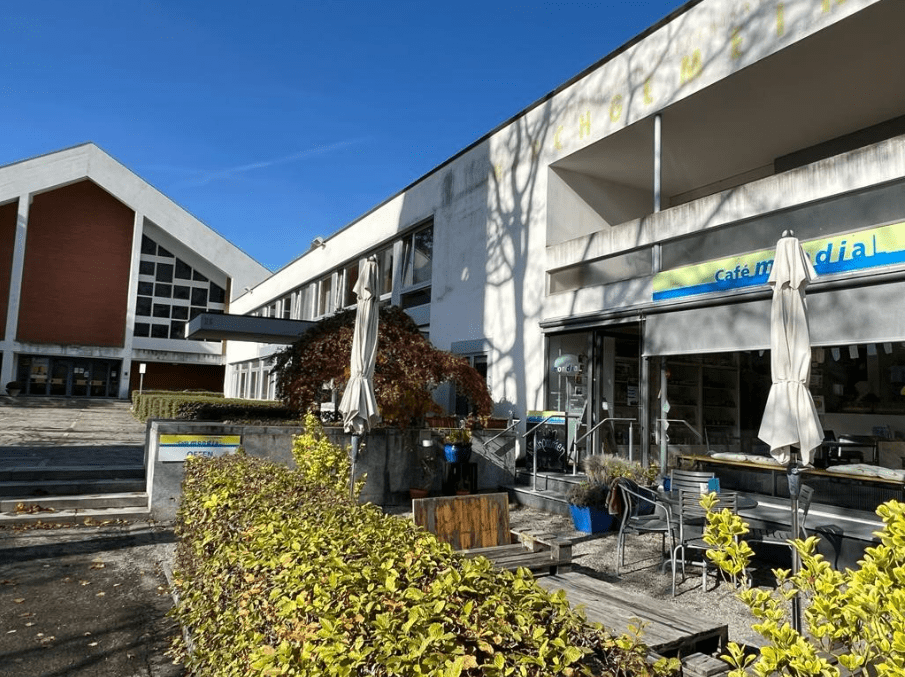

+++
title = "Integration Reportage von Deniz und Ali"
date = "2022-12-01"
draft = false
pinned = false
tags = ["DeutschReportage"]
image = "clay-banks-ljqarjajotc-unsplash-2-.jpg"
description = "Zusammen mit meinem Reportagepartner haben wir eine Kirche besucht und uns über Integration informiert."
+++
##### Erfolgreiche Integration 

##### Deniz Sevik, Ali Guweidhi, begleiten eine erfahrene Integrationsexpertin und dokumentieren ihre Arbeit. Wir lernen dabei wichtige Elemente erfolgreicher Integration kennen. 

##### Am Mittwochnachmittag, dem 26.10.2022 trafen wir in der reformierte Kirche Betlehems mit einer Person, die aus Syrien in die Schweiz geflüchtet hatte und es geschafft hatte, sich in der Gesellschaft zu einfinden und zu arbeiten. Es war Ahlam Ali. Ahlam Ali arbeitet seit 2018 bei «Infotime Bern» als Beraterin und Vermittlerin für arabisch sprechende Migrant: innen. Am Anfang waren wir in Ahlams Büro eingeladen. Dort setzten wir uns mit ihr auseinander und nahmen das Interview auf. 

##### Kriege, Konflikte oder auch politische Verfolgungen sind heute leider nach wie vor in vielen Teilen der Welt zu antreffen. Diese Veranstaltungen führen unter anderem dazu, dass Menschen aus ihrem Heimatland flüchten müssen, um sich ein Leben ohne Angst mit etwas Wohlstand ermöglichen zu können. Viele Menschen flüchten deshalb in ein Land, in dem sie eine längerfristige Aufenthaltsbewilligung erhalten und in dem sie von der einheimischen Gesellschaft akzeptiert und toleriert werden. Dafür muss dieses Land über einen guten Integrationsprozess verfügen. Deniz Sevik und Ali Guweidhi sind auch betroffen, da sie beide in der Schweiz als integriert gelten. Deren Familien haben den Integrationsprozess durchlaufen. Diesen Prozess wollen wir nun genauer analysieren und dabei herausfinden, wie es in der Schweiz weitergeht, nachdem man im Land aufgenommen worden ist. Dabei wollten wir den Fokus auf Anlaufstellen legen, die unsere Familien, aber auch viele andere Migranten, bei der Integration unterstützen. Diese Beratungsstellen sind es, die uns geholfen haben, Teil der Schweizer Gesellschaft zu werden und unsere Familien dabei unterstützten, Arbeit zu finden.  

##### Trotz schrecklicher Erlebnisse während ihrer damaligen Flucht hatte Ahlam Ali den starken Willen entwickelt, in eine neue Gesellschaft einzusteigen. Auch wenn das für sie heisst, hatte, bei Null anzufangen. Das beeindruckte uns. Wir fragten Ahlam deshalb, was Flüchtlinge machen sollen, damit sie sich möglichst gut integrieren können. «Natürlich ist alles vom Aufenthaltsstatus abhängig. Je nach Art der Aufenthaltsbewilligung kann es beim Integrationsprozess gewisse Einschränkungen geben» antwortete sie. Deshalb nahm Ahlam in ihrer Antwort schliesslich nur Bezug auf jene Migrant:innen, die eine längerfristige Aufenthaltsbewilligung haben. «Damit ein Ausländer Arbeit findet, muss er zuerst gute Sprachkenntnisse haben», schilderte Ahlam. Es sei in der Schweiz sehr wichtig, die deutsche Sprache wenigstens bis auf Stufe B1 zu erlernen, um an eine Arbeitsstelle zu kommen oder um eine sinnvolle Ausbildung absolvieren zu können. «Ausserdem soll man lockerer sein und sich damit abfinden, dass gewisse Sachen anders sind und laufen als in der Heimat», erweiterte Ahlam. Dies meint sie insbesondere in Beziehung auf die Kultur, wie sie verdeutlicht. Dieser Aussage ist für uns nicht vollständig, denn auf die eigene Kultur kann man auch stolz sein. Die Kultur ist ein Teil der eigenen Identität. Ahlam fährt fort und betont, man solle liebevoll verhandeln mit den einheimischen Menschen aus dem eigenen unmittelbaren Umfeld, damit man schneller und einfacher Teil der Gesellschaft werden könne. Die Sprache spiele dabei erneut eine sehr wichtige Rolle. Migrant\*innen sollen sich deshalb möglichst mit Menschen vernetzen, die gut Deutsch sprechen können. «Die Integration befasst sich damit, Beziehung zwischen Menschen ausländischer und einheimischer Herkunft herzustellen und diese bestmöglich zu vermischen, so dass daraus eine positiv gelebte Gemeinschaft entsteht», beschreibt Ahlam Ali die Integration. Man solle deshalb auch zeigen, dass man sich integrieren wolle. «Man darf nicht nur die einheimische Sprache lernen, sondern auch an den vielfältigen Aktivitäten teilnehmen, die der Migrant\*innen angeboten werden», erweiterte Ahlam. Viele Schweizer\*innen engagieren sich beispielsweise ehrenamtlich in Kirchen für Migrant\*innen, indem sie interkulturelle Aktivitäten durchführen. 

##### Wir wurden mit dem Interview fertig, sorgten die Aufnahmematerialien weg und unterhielten uns in Ahlams Büro weiter. Wir wurden mit Kaffee und Süssigkeiten bedient. Als die Rede im Interview mit Kirchen aufhörte, packte uns die Neugier und fragten wir Ahlam, wie sie am besten die reformierte Kirche beschreiben könnte.  Ihr Antwort war die Folgende. 

> ##### «Menschen aus den verschiedensten Kulturen, Religionen und Ländern finden hier ihr Zuhause.» Ahlam Ali, Vermittlerin der arabischen Gesellschaft in Bern-West. 

* ##### Kirche Bethlehem, Haus der Kulturen 

##### Die reformierte Kirchgemeinde Bethlehem ist Heimat von engagierten Mitarbeitenden, Kirchgemeinde\*räten sowie vielen Freiwilligen in den unterschiedlichsten Projekten. Insbesondere die Quartierbewohner\*innen liegen der Kirchengemeinde am Herzen, weshalb die Kirche tagtäglich für sie im Einsatz ist. Das Kirchgemeindehaus Bethlehem beherbergt Büros, Schulräume, das Café mondiaL sowie weitere Räume für unterschiedliche Menschen und deren Bedürfnisse. So bietet die Kirche eine breite Themen-Palette an interkulturellen Angeboten für verschiedenste Altersgruppen an. Bethlehem sei unter anderem deshalb ein Ort, wo sich die Welt trifft, meint Ahlam. Es war beeindruckend, dass sich in der Kirche eine Mischung aus Kulturen miteinander austauschen können. Für Migrant*innen gebe es viele Angebote wie zum Beispiel die interkulturellen Muttertreffen: Einmal im Monat, jeweils an einem Donnerstag, treffen sich Frauen zum Kennenlernen und Austauschen. Jedes Mal wird ein anderes Thema besprochen. Zum Beispiel Kindererziehung, Frauenrechte, Finanzen, Arbeit oder Ausbildung. «Diese Treffen helfen den Müttern bzw. Frauen, sich über die Schweiz zu informieren und sich so besser integrieren zu können», betont Ahlam. Das Engagement der reformierten Kirche finden wir lobenswert. Die Kirche setzt ihren Glauben nicht nur in dem Dienst ihres Gottes, sondern auch in dem Unterstützen der Menschen. Teil des Angebots der reformierten Kirche sind schliesslich noch das Café mondiaL und die Infotime Bern, für die sich Ahlam Ali engagiert.  

##### Als Ahlams Wecker klingelte war der Zeit für unser Gespräch zu Ende und Ahlam musste zu dem Laden gehen. Denn Ahlam hatte an diesem Tag ihre Verantwortung an das Café. Wir folgten ihr und begleiteten ihren Alltag weiter.  

#####   

* ##### Café mondiaL, ein Laden mit fairen Produkten zu dem fairen Preis 

##### Café, claro Laden, Info-Point und Ort der Begegnung für viele Menschen. Das Café, wie auch der Laden, bietet Produkte aus gerechtem Handel zu fairen Preisen an. Das Sortiment des claro-Ladens reicht von hochwertigen Ölen über viele Kaffee- und Teesorten bis hin zu manchen Süssigkeiten und Artikeln des täglichen Bedarfs. Der Laden ist jeweils am Dienstag, Mittwoch, Donnerstag und Samstag geöffnet. Im Café arbeiten hauptsächlich Migrant:innen aus verschiedensten Ländern sowie einige wenige Schweizer:innen jeweils über den Mittag.

 ")

##### Als wir in dem Laden angekommen waren, gab es schon ein Paar Kunden. Es war erstaunlich, denn die Preise waren billig und es hatte eine schöne Stimmung in dem Laden. Der Aussicht war auch wunderschön an diesem Tag, da das Wetter gut war. 

##### Ahlam Ali trägt ab und zu Verantwortung für das Café. Was das Café zu etwas Besonderem macht, ist es, dass die Gerichte meistens vegetarisch zubereitet werden und dass das Angebot von denjenigen zusammengestellt werden, die an den jeweiligen Tagen für das Café zuständig sind. «Die Gerichte sind also von der jeweiligen Kultur der oder des Mitarbeitenden geprägt», meint Ahlam. Im Café herrscht Vertrauen gegenüber den Gästen.  

##### Eine Frau trat und wollte eine Mahlzeit haben. Die Frau hatte kein Geld dabei, weshalb sie Ahlam fragte, ob es irgendeine Lösung gäbe. «Wenn jemand kein Geld dabei hat, ist das gar kein Problem. Einfach beim nächsten Besuch mitnehmen», antwortete Ahlam.  

##### Im Laden haben Kunden zudem die Möglichkeit, für gute Zwecke zu spenden, indem sie bestimmte Produkte wie beispielsweise Kerzen einkaufen. Der Sozialdienst der Kirchgemeinde Bethlehem befindet sich gleich über dem Café. Daher sind dessen Angestellten Stammkund*innen des Cafés. So wird das Mittagessen im mondiaL zu einer Art Fusion zwischen dem ausländischen Koch oder der ausländische Köchin und den Schweizer Sozialarbeiter:innen. 

##### Ahlam hatte ihre Verantwortung gegenüber dem Laden erledigt und war somit fertig mit ihrem Anteil fertig. Als nächstes muss sie zurück zu ihrem Büro für der Führung ihre Beratungsstunden auf Arabisch, welche Infotime Bern heisst. Im weg erzählte uns Ahlam, wie gut der Laden ihr unterstützte, sich in der schweizerischen Gemeinschaft einzufinden. 

> #####  «Das Café ist für mich wie eine Integrationsübung» Ahlam Ali, Vermittlerin der arabischen Gesellschaft in Bern-West. 

")

* ##### Erstekasten Text über Ahlam Ali, Interviewpartnerin. 

##### Ahlam Ali kommt ursprünglich aus Syrien und hat das Flüchten erlebt. Sie ist 35 Jahre alt, verheiratet und hat zwei Kinder. Ahlam arbeitet bei Infotime Bern, einer Organisation, welche Beratung in den Muttersprachen anbietet. Dort begleitet sie und beratet arabisch sprechende Migrant*innen und führt ihnen zur Fachstelle. Dafür absolvierte sie die Ausbildung als interkulturelle Dolmetscherin. Ahlam arbeitet auch in dem Café mondiaL, wo sie traditionelle Gerichte zubereitet und mit anderen Migrant:innen regelmässig den Laden beaufsichtigen.  

* ##### Infotime Bern, Beratung auf die Muttersprache 

##### In dem Infotime-Büro beratet Ahlam die arabisch sprechenden Menschen jeweils am Dienstag in deren Muttersprache. Der Dienst von Infotime Bern ist kostenlos. Infotime Bern wurde vom Non-Profit-Verband Bernischer Gemeinden (VBG) gegründet und steht Migrant:innen der Region Bern-West zur Verfügung. Das VBG setzt sich seit 1967 zusammen mit der Bevölkerung und quartiernahen Organisationen für starke Nachbarschaften und mehr Lebensqualität in den Berner Quartieren ein.  

##### «Häufig sind es finanzielle Fragen», meinte Ahlam Ali, als wir sie gefragt hatten, welche Probleme denn am meisten besprochen werden. Vor allem ginge es darum, wie man beispielsweise «Unterstützung für das Zahlen der vielen Rechnungen erhalten könnte. Natürlich gibt es noch andere Problemstellungen», besagte uns Ahlam und fügte hinzu, «Beispielsweise die Suche nach einer Wohnung, das Schreiben von Bewerbungen oder das Ausfüllen von Formularen für Geflüchteten, Spitäler oder Sozialdienste».  

##### Ausserdem begleitet sie Nichtdeutschsprechende auch ausserhalb ihrer Arbeitszeit zum Übersetzen. «Flüchtlinge versuchen sich oft zu integrieren, wissen aber nicht wie», sagt Ahlam. Deshalb leistet sie oft auch Vernetzungsarbeit. In diesem Zusammenhang ist es Ahlams Aufgabe, die Migrant:innen die Tür zur schweizerischen Gesellschaft und Kultur zu öffnen, indem sie ihnen interkulturelle Aktivitäten oder Treffen empfehlt.  

 ")

* ##### Was wir daraus gehalten haben. 

##### An Ahlam Ali beeindruckt uns vor allem, dass sie sich als Flüchtling so gut integrieren gekonnt hat. So wie wir es sehen, ist sie ein gutes Beispiel eine erfolgreiche Integration. Sie wird in der schweizerischen Gesellschaft wahrgenommen und ist mittlerweile wertvoller Teil davon. Ihre Erfahrungen und ihr Wissen teilt sie und hilft damit anderen Menschen, was für sie die Integration noch angeht. Obwohl wir den Integrationsprozess kennen, lernen wir durch unsere Arbeit viel Neues über Ahlams unschätzbarer Funktion in der reformierten Kirche. Auch die vielfältigen Projekte der Kirche Bethlehems überzeugen uns. Sie alle haben zum Ziel, Flüchtlinge in der schweizerischen Gesellschaft zu empfangen und sie Schritt für Schritt zu integrieren. 

* ##### Zweite Kasten Text über schweizerischer Integrationspolitik 

##### Die Schweizer Integrationspolitik richtet sich am Prinzip «Fördern und Fordern» aus. Mit «Fordern» wird die Selbstverantwortung der Zugewanderten angesprochen. Die ausländerrechtlichen Erfordernisse legen fest, was von ihnen erwartet wird und mit welchen Folgen sie gegebenenfalls rechnen müssen, wenn sie diese Erfordernisse nicht erfüllen. Das «Fördern» umfasst alle Massnahmen, welche die Integration der Migrationsbevölkerung unterstützen.